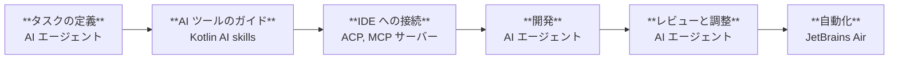

[//]: # (title: Kotlin 開発向け AI ツール)
[//]: # (description: AI で Kotlin 開発を強化しましょう。AI Assistant、Junie、JetBrains Air、Kotlin AI skills、コーディングエージェント、および IDE 統合を使用して、コードの作成、テスト、レビュー、リファクタリングを行う方法を学びます。)

AI を活用したツールは、Kotlin 開発におけるさまざまなタスクを支援します。コードの生成や説明、機能の実装、テストの作成、変更内容のレビュー、既存コードのリファクタリング、定期的な開発タスクの自動化などが可能です。

Kotlin エコシステムには、インタラクティブな開発、AI エージェント、大規模なエージェントオーケストレーションのためのツールが含まれています。ワークフローに応じて、以下のことが可能です。

* : IntelliJ IDEA や Android Studio などの IDE で AI 機能を直接使用する。
* [AI エージェントの活用](#use-ai-agents): Junie などの AI エージェントやサードパーティ製エージェントを選択し、Kotlin AI skills でその Kotlin に関する専門知識を向上させる。
* [AI 開発の管理とスケーリング](#manage-ai-agents): 対話型および自動化されたエージェントのワークフローを調整する。

このページでは、各ツールの違いと、ワークフローのさまざまな段階でそれらがどのように役立つかについて説明します。

## IDE での開発 {id="develop-in-the-ide"}

IDE は、開発環境内で直接 AI 支援機能を提供できます。IDE を離れることなく、Kotlin コードの記述、変更、レビューを行えます。

### AI Assistant {id="ai-assistant"}

[AI Assistant](https://plugins.jetbrains.com/plugin/22282-jetbrains-ai-assistant) は、[IntelliJ IDEA](https://www.jetbrains.com/idea/download/) などの JetBrains IDE や [Android Studio](https://developer.android.com/studio) で直接 AI による支援を提供します。各変更内容を自分でコントロールしながら進めたい対話型の開発タスクに利用できます。

AI Assistant は以下を提供します。

* [Junie](https://www.jetbrains.com/junie/)、Claude Code、OpenAI Codex、および [Agent Client Protocol](#agent-client-protocol) をサポートするサードパーティ製エージェントを含む、AI エージェントへのアクセス。
* Gemini、GPT、Claude などのクラウドホスト型モデルや独自のローカルモデルを使用した、コンテキストに応じた AI チャット。
* AI 支援によるコード補完と次の編集候補の提案。

詳細については、[JetBrains IDE との AI Assistant 統合](https://www.jetbrains.com/help/ai-assistant/about-ai-assistant.html)を参照してください。

### Agent Client Protocol {id="agent-client-protocol"}

Agent Client Protocol（ACP）は、AI エージェントを IDE やコードエディターに接続するためのオープンプロトコルです。ACP は、エージェントとエディターの組み合わせごとに個別の連携を実装することなく、AI エージェントと開発ツールが通信するための共通プロトコルを定義します。

JetBrains IDE は ACP をサポートしており、互換性のある AI エージェントを IDE 内で使用できます。ナビゲーション、インスペクション、リファクタリング、デバッグ、プロジェクト分析など、Kotlin を認識する IDE 機能を利用しながら、さまざまな AI エージェントを選択できます。

ACP レジストリを使用すると、Claude Agent、Cursor、GitHub Copilot、OpenCode などの複数のエージェントにアクセスできます。サポートされているエージェントの完全なリストは、[ACP レジストリ](https://agentclientprotocol.com/get-started/registry)を参照してください。

## AI エージェントの活用 {id="use-ai-agents"}

AI エージェントは、対話型の AI アシスタントよりも直接的な指示が少ない状態で開発タスクを実行できます。たとえば、プロジェクトの探索、実装手順の計画、複数ファイルの変更、コマンドやテストの実行などを行えます。

> 使用する AI エージェントに迷った場合は、[Kotlin Benchmark](https://kotlinlang.org/benchmark/) を確認して、Kotlin 開発タスクにおける各種エージェントのパフォーマンスを比較してみてください。
> 
{style="tip"}

### Junie {id="junie"}

[Junie](https://junie.jetbrains.com/) は JetBrains 製の AI エージェントです。Junie は [JetBrains IDE および Android Studio 内](https://plugins.jetbrains.com/plugin/26104-junie-the-ai-coding-agent-by-jetbrains)、[ターミナルから](https://junie.jetbrains.com/docs/junie-cli.html)、または CI/CD パイプラインの [ヘッドレスモード](https://junie.jetbrains.com/docs/junie-headless.html) で利用できます。また、Junie を [GitHub ワークフロー](https://junie.jetbrains.com/docs/junie-on-github.html) に統合することも可能です。

Junie は、単一のコード提案やチャットの応答以上のものを必要とするタスク向けに設計されています。複数ファイルが関係するタスクや、計画と実行を必要とする開発タスクには Junie を使用してください。機能の実装、複数ファイルにわたるコードの更新、テストの追加、メンテナンス作業の実施などを依頼できます。

Junie を IDE 内で実行すると、プロジェクトのインデックス作成、コードナビゲーション、インスペクション、リファクタリング、デバッグ、フレームワークに対応したプロジェクト分析など、IDE の機能も利用できます。

詳細については、[Junie](https://junie.jetbrains.com/docs/get-started-with-junie.html) を参照してください。

### サードパーティ製 AI エージェント {id="third-party-ai-agents"}

多くのサードパーティ製 AI 開発ツールが Kotlin をサポートしています。これらは IDE 拡張機能、スタンドアロンエディター、コマンドラインツール、クラウドベースの開発環境として利用できます。例：

* GitHub Copilot
* Google Gemini
* Claude Code
* OpenAI Codex

好みの開発環境に合っている場合や、ワークフローに適した機能を提供している場合は、サードパーティ製ツールを選択してください。これらのツールの多くは、Kotlin コードの生成、説明、テストの作成、リファクタリングをサポートしています。

サードパーティ製ツールを単独で使用することも、[ACP](#agent-client-protocol) 経由で互換性のあるエージェントを JetBrains IDE に接続することもできます。

### MCP サーバー {id="mcp-servers"}

Model Context Protocol（MCP）は、AI モデルを外部のデータソース、ツール、システムに接続します。JetBrains は、Kotlin の開発効率を高めるいくつかの MCP サーバーを提供しています。

* [JetBrains IDE MCP サーバー](https://plugins.jetbrains.com/plugin/26071-mcp-server) は IDE の機能を公開します。このサーバーを使用すると、AI エージェントはプロジェクトのインデックス作成、コードナビゲーション、リファクタリング、インスペクション、ビルド実行などの IDE 機能を利用できます。これにより、エージェントは Kotlin プロジェクトをより深く理解し、コードの生成や評価をより効率的に行うことができます。
* [MCP Kotlin SDK](kotlin-ai-apps-development-overview.md#model-context-protocol-mcp-kotlin-sdk) は、Kotlin Multiplatform の実装です。Kotlin で AI 搭載アプリケーションを構築し、JVM、WebAssembly、iOS 全般の LLM サーフェスと統合するのに役立ちます。
* Kotlin Multiplatform プロジェクト向けに、[klibs.io MCP サーバー](https://github.com/JetBrains/klibs-io/blob/master/integrations/mcp/README.md) は、エージェントが利用可能なマルチプラットフォームライブラリのカタログにアクセスできるようにし、既存のソリューションをより効率的に探せるように支援します。
* Compose Multiplatform プロジェクト向けに、[Compose Hot Reload MCP サーバー](https://kotlinlang.org/docs/multiplatform/compose-hot-reload.html#mcp-server-for-ai-agents) を使用すると、エージェントがリロード可能なアプリと直接対話し、リロードのトリガー、スクリーンショットの取得、セマンティックツリーの読み取りなどを行えます。

### Kotlin AI skills {id="kotlin-ai-skills"}

Kotlin AI skills は、Kotlin 開発タスクを通じて AI エージェントをガイドする再利用可能な指示（インストラクション）です。エージェントがこれらのタスクをより一貫性を持って実行できるように支援します。

イディオマティック（慣用的な）な Kotlin パターン、Kotlin コーディング規約、およびプロジェクト固有の要件に従ってエージェントを誘導したい場合は、Kotlin AI skills を使用してください。スキルは、Kotlin コードの記述、言語機能の説明、ドキュメントの生成、テストの作成、コードのレビュー、移行ガイダンスの適用などのタスクを AI エージェントが実行する際に役立ちます。

Kotlin AI skills は、IDE ベースのエージェント、コマンドラインエージェント、および再利用可能な指示をサポートする外部 AI ツールを含む、さまざまなエージェントやワークフローで使用できます。

詳細については、 を参照してください。

### Kotlin 固有の受け入れ基準 {id="kotlin-specific-acceptance-criteria"}

特に Kotlin Multiplatform プロジェクトは複雑であるため、エージェントがプロジェクト全体の構造や特定の変更がもたらす影響を見失ってしまうことがあります。

エージェントを支援するために、一般的な成功基準（[AGENTS.md](https://agents.md/)）またはタスク固有の成功基準として、以下の例を含めることができます。

* 変更を加えた後は、利用可能なターゲット固有のテストがあれば必ず実行する。
* すべての設定済み KMP ターゲットが正常にビルドできることを確認してから、タスクが完了したとみなす。
* プラットフォーム固有の API が共通コード（common code）に漏出していないか実装をレビューし、エージェント（または開発者）が後から共通コード内で誤ってこれらの API を使用してしまうのを防ぐ。

## AI エージェントの管理 {id="manage-ai-agents"}

開発チームは、定期的なタスクの自動化、エージェントのアクティビティの監視、または採用を決定する前の各種ツールの評価のために、複数の AI エージェントを必要とする場合があります。以下のツールは、個々のコーディングセッションにとどまらない AI 支援開発をサポートします。

### JetBrains Air {id="jetbrains-air"}

[JetBrains Air](https://air.dev/) は、AI を活用して製品を構築するエンジニアリングチーム向けのエージェンティック開発環境（Agentic Development Environment: ADE）です。Air を使用すると、各タスクのコンテキストを提供し、エージェント、モデル、実行環境を選択して、生成された変更をコードに適用する前にレビューや調整を行うことができます。

定義したコーディングタスクを AI エージェントに委任したい場合、AI が生成した変更をローカルの作業コピーから隔離したい場合、複数の実装タスクを並行して実行したい場合、または定期的な開発タスクをスケジュール設定されたイベント駆動型の自動化に変換したい場合に Air を使用してください。タスクは、ローカルワークスペース、分離された Git ワークツリーや Docker コンテナ、および JetBrains が管理するクラウド環境で実行できます。

JetBrains Air は以下から利用できます。

* **Air デスクトップアプリ** – デスクトップアプリケーションからローカルタスクやクラウドタスクを実行します。
* **Air on the web** – Web ブラウザからクラウドタスクや自動化を実行、監視、管理します。
* **IntelliJ ベースの IDE 内の AI Assistant** – IDE を離れることなく、クラウドタスクの開始や結果のレビューを行えます。Air デスクトップアプリや Web バージョンでも同じタスクを操作できます。

詳細については、[JetBrains Air](https://www.jetbrains.com/help/air/getting-started.html) を参照してください。

### JetBrains Central {id="jetbrains-central"}

[JetBrains Central](https://www.jetbrains.com/agentic-software-development/) は、組織全体でのエージェンティックソフトウェア開発のためのプラットフォームです。AI エージェント、開発ツール、インフラストラクチャを接続することで、エージェント主導の作業を実行、監視、チーム全体で管理できるようにし、成果、コスト、パフォーマンスの可視化を実現します。

[JetBrains Central Console](https://www.jetbrains.com/help/jetbrains-console/about-jetbrains-console.html) は、JetBrains Central において組織レベルの AI ガバナンスを行うための Web インターフェースです。組織の管理者は Console を使用して、アクセス権とポリシーの管理、AI の使用状況と費用の監視、導入状況の分析、チームが使用できる AI モデルや機能の制御を行うことができます。

詳細については、[エージェンティックソフトウェア開発](https://www.jetbrains.com/agentic-software-development/) を参照してください。