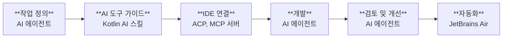

[//]: # (title: Kotlin 개발을 위한 AI 도구)
[//]: # (description: AI를 통해 Kotlin 개발 생산성을 높이고, AI Assistant, Junie, JetBrains Air, Kotlin AI 스킬, 코딩 에이전트, IDE 연동을 활용하여 코드를 작성, 테스트, 리뷰, 리팩터링하는 방법을 알아봅니다.)

AI 기반 도구는 다양한 Kotlin 개발 작업을 지원할 수 있습니다. 코드를 생성하고 설명하며, 기능을 구현하고, 테스트를 작성하고, 변경 사항을 리뷰하고, 기존 코드를 리팩터링하며, 반복적인 개발 작업을 자동화할 수 있습니다.

Kotlin 생태계에는 대화형 개발을 위한 도구, AI 에이전트, 대규모 에이전트 오케스트레이션을 위한 도구가 포함되어 있습니다. 워크플로에 따라 다음과 같은 작업을 수행할 수 있습니다.

* : IntelliJ IDEA 및 Android Studio와 같은 IDE에서 AI 기능을 직접 사용합니다.
* [AI 에이전트 활용](#use-ai-agents): Junie나 서드파티 에이전트 등의 AI 에이전트를 선택하고, Kotlin AI 스킬을 통해 해당 에이전트의 Kotlin 전문성을 강화합니다.
* [AI 개발 관리 및 확장](#manage-ai-agents): 대화형 및 자동화된 에이전트 워크플로를 조율합니다.

이 페이지에서는 이러한 도구 간의 차이점과 개발 워크플로의 각 단계에서 도구를 활용하는 방법을 설명합니다.

## IDE에서 개발하기 {id="develop-in-the-ide"}

IDE는 개발 환경에서 AI 기반 기능을 직접 제공할 수 있습니다. IDE를 벗어나지 않고도 Kotlin 코드를 작성, 수정 및 리뷰할 수 있습니다.

### AI Assistant {id="ai-assistant"}

[AI Assistant](https://plugins.jetbrains.com/plugin/22282-jetbrains-ai-assistant)는 [IntelliJ IDEA](https://www.jetbrains.com/idea/download/)와 같은 JetBrains IDE뿐만 아니라 [Android Studio](https://developer.android.com/studio)에서도 AI 기반 지원을 직접 제공합니다. 각 변경 사항을 직접 제어하면서 대화형으로 개발 작업을 진행하고자 할 때 사용할 수 있습니다.

AI Assistant는 다음을 제공합니다.

* [Junie](https://www.jetbrains.com/junie/), Claude Code, OpenAI Codex 및 [Agent Client Protocol](#agent-client-protocol)을 지원하는 모든 서드파티 에이전트를 포함한 AI 에이전트 접근 권한.
* Gemini, GPT, Claude와 같은 클라우드 호스팅 모델 및 자체 로컬 모델을 사용하는 컨텍스트 인식 AI 채팅.
* AI 지원 코드 완성 및 다음 편집(next edit) 제안.

[JetBrains IDE의 AI Assistant 연동](https://www.jetbrains.com/help/ai-assistant/about-ai-assistant.html)에 대해 자세히 알아보세요.

### Agent Client Protocol {id="agent-client-protocol"}

Agent Client Protocol(ACP)은 AI 에이전트를 IDE 및 코드 에디터에 연결하기 위한 오픈 프로토콜입니다. ACP는 AI 에이전트와 개발 도구가 에이전트와 에디터의 조합마다 개별적으로 연동할 필요 없이 통신할 수 있도록 공통 프로토콜을 정의합니다.

JetBrains IDE는 ACP를 지원하므로 호환되는 AI 에이전트를 IDE 내에서 사용할 수 있습니다. 탐색, 코드 검사(inspection), 리팩터링, 디버깅, 프로젝트 분석과 같은 Kotlin 인식 IDE 기능을 활용하면서 다양한 AI 에이전트를 선택해 작업할 수 있습니다.

ACP 레지스트리를 통해 Claude Agent, Cursor, GitHub Copilot, OpenCode 등을 포함한 여러 에이전트에 접근할 수 있습니다. 지원되는 에이전트의 전체 목록은 [ACP 레지스트리](https://agentclientprotocol.com/get-started/registry)에서 확인하세요.

## AI 에이전트 활용 {id="use-ai-agents"}

AI 에이전트는 대화형 AI 어시스턴트보다 덜 직접적인 지시만으로도 개발 작업을 수행할 수 있습니다. 예를 들어 프로젝트를 탐색하고, 구현 단계를 계획하며, 여러 파일을 수정하거나, 명령어와 테스트를 실행할 수 있습니다.

> 어떤 AI 에이전트를 사용해야 할지 잘 모르겠다면, [Kotlin Benchmark](https://kotlinlang.org/benchmark/)를 확인하여 Kotlin 개발 작업에서 각 에이전트의 성능을 비교해 보세요.
> 
{style="tip"}

### Junie {id="junie"}

[Junie](https://junie.jetbrains.com/)는 JetBrains의 AI 에이전트입니다. Junie는 [JetBrains IDE 및 Android Studio](https://plugins.jetbrains.com/plugin/26104-junie-the-ai-coding-agent-by-jetbrains), [터미널](https://junie.jetbrains.com/docs/junie-cli.html), 또는 CI/CD 파이프라인의 [헤드리스 모드](https://junie.jetbrains.com/docs/junie-headless.html)에서 사용할 수 있습니다. 또한 Junie를 [GitHub 워크플로](https://junie.jetbrains.com/docs/junie-on-github.html)에 통합할 수도 있습니다.

Junie는 단순한 코드 제안이나 채팅 응답 이상의 작업이 필요한 환경을 위해 설계되었습니다. 여러 파일이 관련되거나 계획 및 실행이 필요한 개발 작업에 Junie를 사용하세요. 기능 구현, 여러 파일에 걸친 코드 업데이트, 테스트 추가, 유지보수 작업 수행 등을 요청할 수 있습니다.

Junie가 IDE에서 실행될 때는 프로젝트 인덱싱, 코드 탐색, 코드 검사, 리팩터링, 디버깅 및 프레임워크 인식 프로젝트 분석과 같은 IDE 기능을 활용할 수도 있습니다.

[Junie](https://junie.jetbrains.com/docs/get-started-with-junie.html)에 대해 자세히 알아보세요.

### 서드파티 AI 에이전트 {id="third-party-ai-agents"}

많은 서드파티 AI 개발 도구가 Kotlin을 지원합니다. 이러한 도구는 IDE 확장 프로그램, 독립형 에디터, 명령줄 도구, 클라우드 기반 개발 환경으로 제공됩니다. 예시는 다음과 같습니다.

* GitHub Copilot
* Google Gemini
* Claude Code
* OpenAI Codex

선호하는 개발 환경과 일치하거나 워크플로에 맞는 기능을 제공하는 서드파티 도구를 선택하세요. 이러한 도구 중 상당수는 Kotlin 코드 생성, 코드 설명, 테스트 생성, 리팩터링을 지원합니다.

서드파티 도구를 독립적으로 사용하거나, [ACP](#agent-client-protocol)를 통해 호환되는 에이전트를 JetBrains IDE에 연결할 수 있습니다.

### MCP 서버 {id="mcp-servers"}

Model Context Protocol(MCP)은 AI 모델을 외부 데이터 소스, 도구 및 시스템에 연결합니다. JetBrains는 Kotlin 개발 환경을 더욱 생산적으로 만들어 주는 여러 MCP 서버를 관리합니다.

* [JetBrains IDE MCP 서버](https://plugins.jetbrains.com/plugin/26071-mcp-server)는 IDE 기능을 노출합니다. AI 에이전트는 이 서버를 통해 프로젝트 인덱싱, 코드 탐색, 리팩터링, 코드 검사, 빌드 실행과 같은 IDE 기능을 사용할 수 있습니다. 이를 통해 에이전트는 Kotlin 프로젝트를 더 잘 이해하고 코드를 더욱 효율적으로 생성 및 평가할 수 있습니다.
* [MCP Kotlin SDK](kotlin-ai-apps-development-overview.md#model-context-protocol-mcp-kotlin-sdk)는 Kotlin Multiplatform 구현체입니다. Kotlin으로 AI 기반 애플리케이션을 구축하고 JVM, WebAssembly, iOS 전반의 LLM 환경과 연동할 수 있도록 지원합니다.
* Kotlin Multiplatform 프로젝트의 경우, [klibs.io MCP 서버](https://github.com/JetBrains/klibs-io/blob/master/integrations/mcp/README.md)를 통해 에이전트가 사용 가능한 멀티플랫폼 라이브러리 카탈로그에 접근하여 기존 솔루션을 보다 효율적으로 탐색할 수 있습니다.
* Compose Multiplatform 프로젝트의 경우, [Compose Hot Reload MCP 서버](https://kotlinlang.org/docs/multiplatform/compose-hot-reload.html#mcp-server-for-ai-agents)를 통해 에이전트가 리로드를 지원하는 앱과 직접 상호작용할 수 있습니다(리로드 트리거, 스크린샷 캡처, 시맨틱 트리 읽기 등).

### Kotlin AI 스킬 {id="kotlin-ai-skills"}

Kotlin AI 스킬은 AI 에이전트가 Kotlin 개발 작업을 수행하도록 안내하는 재사용 가능한 지침(instruction)입니다. 에이전트가 이러한 작업을 더욱 일관되게 수행하도록 돕습니다.

에이전트가 관용적인(idiomatic) Kotlin 패턴, Kotlin 코딩 컨벤션 및 프로젝트별 요구 사항을 준수하도록 유도할 때 Kotlin AI 스킬을 사용하세요. 스킬은 AI 에이전트가 Kotlin 코드 작성, 언어 기능 설명, 문서 생성, 테스트 작성, 코드 리뷰, 마이그레이션 가이드 적용과 같은 작업을 수행하는 데 도움이 됩니다.

Kotlin AI 스킬은 IDE 기반 에이전트, 명령줄 에이전트, 재사용 가능한 지침을 지원하는 외부 AI 도구 등 다양한 에이전트 및 워크플로와 함께 사용할 수 있습니다.

에 대해 자세히 알아보세요.

### Kotlin 전용 승인 기준 {id="kotlin-specific-acceptance-criteria"}

특히 Kotlin Multiplatform 프로젝트는 복잡하기 때문에 에이전트가 전체 프로젝트 구조와 특정 변경 사항으로 인한 영향을 놓치기 쉽습니다.

에이전트를 돕기 위해 일반적인 성공 기준([AGENTS.md](https://agents.md/)) 또는 작업별 성공 기준에 다음과 같은 예시를 포함할 수 있습니다.

* 대상별 테스트가 가능한 경우 변경 사항을 적용한 후 타깃별 테스트를 실행합니다.
* 작업을 완료된 것으로 간주하기 전에 설정된 모든 KMP 타깃이 성공적으로 빌드되는지 확인합니다.
* 에이전트(또는 개발자)가 나중에 공통 코드에서 실수로 이러한 API를 사용하는 일이 없도록, 플랫폼별 API가 공통(common) 코드로 누출되지 않았는지 구현을 검토합니다.

## AI 에이전트 관리 {id="manage-ai-agents"}

개발 팀에서는 반복 작업을 자동화하거나, 에이전트 활동을 모니터링하거나, 도입 결정을 내리기 전에 다양한 도구를 평가하기 위해 여러 AI 에이전트가 필요할 수 있습니다. 다음 도구들은 개별 코딩 세션을 넘어선 AI 지원 개발을 지원합니다.

### JetBrains Air {id="jetbrains-air"}

[JetBrains Air](https://air.dev/)는 AI로 제품을 구축하는 엔지니어링 팀을 위한 에이전틱 개발 환경(Agentic Development Environment, ADE)입니다. Air를 사용하면 각 작업의 컨텍스트를 제공하고, 에이전트, 모델 및 실행 환경을 선택한 후 변경 사항을 코드에 적용하기 전에 검토하거나 다듬을 수 있습니다.

정의된 코딩 작업을 AI 에이전트에 위임하거나, AI가 생성한 변경 사항을 로컬 작업 사본과 격리하거나, 여러 구현 작업을 병렬로 실행하거나, 반복적인 개발 작업을 예약 기반 또는 이벤트 기반 자동화로 전환하고자 할 때 Air를 사용하세요. 로컬 워크스페이스, 격리된 Git 워크트리 또는 Docker 컨테이너, JetBrains에서 관리하는 클라우드 환경에서 작업을 실행할 수 있습니다.

JetBrains Air는 다음을 통해 이용할 수 있습니다.

* **Air 데스크톱 앱** – 데스크톱 애플리케이션에서 로컬 및 클라우드 작업을 실행합니다.
* **웹 기반 Air** – 웹 브라우저에서 클라우드 작업 및 자동화를 실행, 모니터링, 관리합니다.
* **IntelliJ 기반 IDE의 AI Assistant** – IDE를 벗어나지 않고 클라우드 작업을 시작하고 결과를 검토합니다. 동일한 작업을 Air 데스크톱 앱이나 웹 버전에서도 처리할 수 있습니다.

[JetBrains Air](https://www.jetbrains.com/help/air/getting-started.html)에 대해 자세히 알아보세요.

### JetBrains Central {id="jetbrains-central"}

[JetBrains Central](https://www.jetbrains.com/agentic-software-development/)은 조직 전반의 에이전틱 소프트웨어 개발을 위한 플랫폼입니다. AI 에이전트, 개발 도구 및 인프라를 연결하여 에이전트 기반 작업이 실행, 모니터링 및 팀 간에 관리될 수 있도록 하며, 결과, 비용 및 성능에 대한 가시성을 제공합니다.

[JetBrains Central Console](https://www.jetbrains.com/help/jetbrains-console/about-jetbrains-console.html)은 JetBrains Central에서 조직 수준의 AI 거버넌스를 위한 웹 인터페이스입니다. 조직 관리자는 Console을 사용하여 접근 권한 및 정책을 관리하고, AI 사용량과 지출을 모니터링하며, 도입 현황을 분석하고, 팀이 사용할 수 있는 AI 모델과 기능을 제어할 수 있습니다.

[에이전틱 소프트웨어 개발](https://www.jetbrains.com/agentic-software-development/)에 대해 자세히 알아보세요.