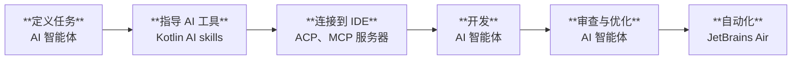

[//]: # (title: 用于 Kotlin 开发的 AI 工具)
[//]: # (description: 利用 AI 提升 Kotlin 开发效率，并了解如何使用 AI Assistant、Junie、JetBrains Air、Kotlin AI skills、编码智能体以及 IDE 集成来编写、测试、审查和重构代码。)

AI 驱动的工具可以协助完成许多 Kotlin 开发任务。它们可以生成并解释代码、实现功能、创建测试、审查更改、重构现有代码，并使周期性的开发任务实现自动化。

Kotlin 生态系统包含用于交互式开发、AI 智能体以及大规模智能体编排的工具。根据你的工作流，你可以：

* ：直接在 IntelliJ IDEA 和 Android Studio 等 IDE 中使用 AI 功能。
* [使用 AI 智能体](#use-ai-agents)：选择如 Junie 或第三方智能体，并通过 Kotlin AI skills 提升其 Kotlin 专业知识。
* [管理和扩展 AI 开发](#manage-ai-agents)：协调交互式和自动化的智能体工作流。

本页面介绍了这些工具之间的差异，以及它们如何在工作流的不同阶段为你带来助益。

## 在 IDE 中开发 {id="develop-in-the-ide"}

IDE 可以直接在开发环境中提供 AI 驱动的功能。你无需离开 IDE 即可编写、修改和审查 Kotlin 代码。

### AI Assistant {id="ai-assistant"}

[AI Assistant](https://plugins.jetbrains.com/plugin/22282-jetbrains-ai-assistant) 在诸如 [IntelliJ IDEA](https://www.jetbrains.com/idea/download/) 等 JetBrains IDE 以及 [Android Studio](https://developer.android.com/studio) 中直接提供 AI 驱动的协助。你可以将其用于希望牢牢把控每次更改的交互式开发任务中。

AI Assistant 提供：

* 访问 AI 智能体，包括 [Junie](https://www.jetbrains.com/junie/)、Claude Code、OpenAI Codex，以及任何支持 [Agent Client Protocol](#agent-client-protocol) 的第三方智能体。
* 使用云端托管模型（如 Gemini、GPT 和 Claude）以及你自己的本地模型进行上下文感知型 AI 对话。
* AI 辅助的代码补全与后续编辑建议。

详细了解 [AI Assistant 与 JetBrains IDE 的集成](https://www.jetbrains.com/help/ai-assistant/about-ai-assistant.html)。

### Agent Client Protocol {id="agent-client-protocol"}

Agent Client Protocol (ACP) 是一项用于将 AI 智能体连接到 IDE 和代码编辑器的开放协议。ACP 定义了通用的协议，使 AI 智能体与开发工具能够进行通信，而无需为每种智能体和编辑器的组合单独进行集成。

JetBrains IDE 支持 ACP，允许你在 IDE 中使用兼容的 AI 智能体。你可以在不同的 AI 智能体之间进行选择，同时使用感知 Kotlin 的 IDE 功能，例如导航、检查、重构、调试和项目分析。

ACP 注册表提供了对多个智能体的访问，包括 Claude Agent、Cursor、GitHub Copilot、OpenCode 等。请在 [ACP 注册表](https://agentclientprotocol.com/get-started/registry)中查看受支持智能体的完整列表。

## 使用 AI 智能体 {id="use-ai-agents"}

相较于交互式 AI 助手，AI 智能体可以在较少的人工直接指导下执行开发任务。例如，它们可以探索项目、规划实现步骤、修改多个文件，或运行命令和测试。

> 如果你不确定该使用哪个 AI 智能体，请查看 [Kotlin 基准测试](https://kotlinlang.org/benchmark/)，比较不同智能体在 Kotlin 开发任务中的表现。
> 
{style="tip"}

### Junie {id="junie"}

[Junie](https://junie.jetbrains.com/) 是一款 JetBrains AI 智能体。你可以[在 JetBrains IDE 和 Android Studio 中](https://plugins.jetbrains.com/plugin/26104-junie-the-ai-coding-agent-by-jetbrains)、[从终端](https://junie.jetbrains.com/docs/junie-cli.html)或以 [headless 模式](https://junie.jetbrains.com/docs/junie-headless.html)在 CI/CD 流水线中使用 Junie。你还可以将 Junie 集成到你的 [GitHub 工作流](https://junie.jetbrains.com/docs/junie-on-github.html)中。

Junie 专为需要超越单次代码建议或对话响应的任务而设计。可以将 Junie 用于涉及多个文件或需要规划和执行的开发任务。你可以要求它实现某项功能、跨多个文件更新代码、添加测试或执行维护工作。

当 Junie 在 IDE 中运行时，它还可以利用 IDE 功能，例如项目索引、代码导航、检查、重构操作、调试以及感知框架的项目分析。

详细了解 [Junie](https://junie.jetbrains.com/docs/get-started-with-junie.html)。

### 第三方 AI 智能体 {id="third-party-ai-agents"}

许多第三方 AI 开发工具都支持 Kotlin。它们以 IDE 扩展程序、独立编辑器、命令行工具和基于云的开发环境等形式提供。例如：

* GitHub Copilot
* Google Gemini
* Claude Code
* OpenAI Codex

如果某个第三方工具契合你常用的开发环境，或者提供了契合你工作流的功能，你可以选用该工具。其中许多工具均支持 Kotlin 代码生成、解释、测试创建和重构。

你可以单独使用第三方工具，也可以通过 [ACP](#agent-client-protocol) 将兼容的智能体连接到 JetBrains IDE。

### MCP 服务器 {id="mcp-servers"}

Model Context Protocol (MCP) 将 AI 模型连接到外部数据源、工具和系统。JetBrains 维护了几个 MCP 服务器，可以使你的 Kotlin 体验更富成效：

* [JetBrains IDE MCP 服务器](https://plugins.jetbrains.com/plugin/26071-mcp-server)公开了 IDE 功能。借助该服务器，AI 智能体可以使用 IDE 功能，例如项目索引、代码导航、重构、检查和构建执行。这使智能体能够更好地理解你的 Kotlin 项目，并以更高效的方式生成和评估代码。
* [MCP Kotlin SDK](kotlin-ai-apps-development-overview.md#model-context-protocol-mcp-kotlin-sdk) 是一个 Kotlin Multiplatform 实现。它可以帮助你使用 Kotlin 构建 AI 驱动的应用程序，并集成跨 JVM、WebAssembly 和 iOS 的大型语言模型接口。
* 对于 Kotlin Multiplatform 项目，[klibs.io MCP 服务器](https://github.com/JetBrains/klibs-io/blob/master/integrations/mcp/README.md)可以帮助智能体访问可用多平台库的目录，以便更高效地寻找现有解决方案。
* 对于 Compose Multiplatform 项目，[Compose Hot Reload MCP 服务器](https://kotlinlang.org/docs/multiplatform/compose-hot-reload.html#mcp-server-for-ai-agents)允许智能体直接与可热重载的应用进行交互：触发重载、获取屏幕截图、读取语义树等。

### Kotlin AI skills {id="kotlin-ai-skills"}

Kotlin AI skills 是可复用的指令集，用于引导 AI 智能体完成 Kotlin 开发任务。它们有助于智能体更加一致地执行这些任务。

当你希望引导智能体遵循地道的 Kotlin 模式、Kotlin 编码规范以及特定于项目的要求时，可以使用 Kotlin AI skills。技能可帮助 AI 智能体执行诸如编写 Kotlin 代码、解释语言功能、生成文档、创建测试、审查代码或应用迁移指南等任务。

Kotlin AI skills 可用于各种不同的智能体和工作流，包括基于 IDE 的智能体、命令行智能体以及支持可复用指令的外部 AI 工具。

详细了解 。

### Kotlin 特定的验收标准 {id="kotlin-specific-acceptance-criteria"}

Kotlin Multiplatform 项目尤为复杂，以至于智能体容易忽略整体的项目结构以及特定更改所带来的后果。

为了协助智能体，你可以将以下示例作为通用 ([AGENTS.md](https://agents.md/)) 或针对具体任务的成功标准：

* 在引入更改后，只要有针对特定目标的测试可用，就运行这些测试。
* 在认定任务完成之前，验证所有已配置的 KMP 目标均能成功构建。
* 审查实现中是否存在平台特有 API 泄漏到通用代码中的情况，以避免智能体（或开发者）随后不慎在通用代码中使用这些 API。

## 管理 AI 智能体 {id="manage-ai-agents"}

开发团队可能需要使用多个 AI 智能体来自动化周期性任务、监控智能体活动，或者在决定采纳之前评估不同的工具。以下工具可在单次编码会话之外，支持 AI 辅助开发。

### JetBrains Air {id="jetbrains-air"}

[JetBrains Air](https://air.dev/) 是面向使用 AI 构建产品的工程团队的智能体开发环境 (Agentic Development Environment, ADE)。借助 Air，你可以为每个任务提供上下文，选择智能体、模型和执行环境，然后在将生成的更改应用到代码之前对其进行审查或优化。

当你希望将明确的编码任务委派给 AI 智能体、将 AI 生成的更改与本地工作副本隔离开来、并行运行多个实现任务，或将周期性开发任务转变为计划任务或事件驱动的自动化任务时，可以使用 Air。你可以在本地工作区、隔离的 Git worktree 或 Docker 容器，以及 JetBrains 托管的云端环境中运行任务。

你可以通过以下方式使用 JetBrains Air：

* **Air 桌面应用** – 从桌面应用程序运行本地和云端任务。
* **Web 版 Air** – 从 Web 浏览器运行、监控和管理云端任务与自动化。
* **基于 IntelliJ 的 IDE 中的 AI Assistant** – 无需离开 IDE 即可启动云端任务并审查结果。在 Air 桌面应用或 Web 版本中处理相同的任务。

详细了解 [JetBrains Air](https://www.jetbrains.com/help/air/getting-started.html)。

### JetBrains Central {id="jetbrains-central"}

[JetBrains Central](https://www.jetbrains.com/agentic-software-development/) 是一个用于在整个组织中进行智能体软件开发的平台。它连接了 AI 智能体、开发工具和基础架构，使得智能体驱动的工作可以在团队之间运行、受监控并得到管理，同时提供对结果、成本和性能的可见性。

[JetBrains Central 控制台](https://www.jetbrains.com/help/jetbrains-console/about-jetbrains-console.html)是用于在 JetBrains Central 中进行组织级 AI 治理的 Web 界面。组织管理员可以使用该控制台来管理访问权限和策略、监控 AI 使用情况和支出、分析采纳度，并控制团队可以使用的 AI 模型和功能。

详细了解[智能体软件开发](https://www.jetbrains.com/agentic-software-development/)。