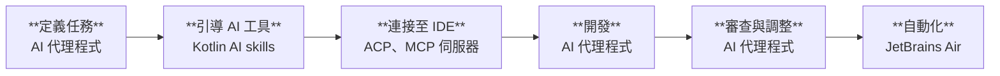

[//]: # (title: 用於 Kotlin 開發的 AI 工具)
[//]: # (description: 借助 AI 提升您的 Kotlin 開發效率，並了解如何使用 AI Assistant、Junie、JetBrains Air、Kotlin AI skills、編碼代理程式以及 IDE 整合來撰寫、測試、審查和重構程式碼。)

AI 驅動的工具可以協助處理許多 Kotlin 開發任務。它們能夠產生與解釋程式碼、實作功能、建立測試、審查變更、重構現有程式碼，以及自動化重複執行的開發任務。

Kotlin 生態系統包含用於互動式開發、AI 代理程式以及大規模代理程式協調整合的工具。根據您的工作流程，您可以：

* ：直接在 IntelliJ IDEA 和 Android Studio 等 IDE 中使用 AI 功能。
* [使用 AI 代理程式](#use-ai-agents)：選擇如 Junie 的 AI 代理程式或第三方代理程式，並透過 Kotlin AI skills 增進其 Kotlin 專業能力。
* [管理與擴展 AI 開發](#manage-ai-agents)：協調互動式與自動化的代理程式工作流程。

本頁面將說明各項工具之間的差異，以及它們如何在工作流程的不同階段為您提供協助。

## 在 IDE 中開發 {id="develop-in-the-ide"}

IDE 可以在您的開發環境中直接提供 AI 驅動的功能。您可以直接在 IDE 中編寫、修改和審查 Kotlin 程式碼，無需離開編輯器。

### AI Assistant {id="ai-assistant"}

[AI Assistant](https://plugins.jetbrains.com/plugin/22282-jetbrains-ai-assistant) 在 JetBrains IDE（例如 [IntelliJ IDEA](https://www.jetbrains.com/idea/download/)）以及 [Android Studio](https://developer.android.com/studio) 中直接提供 AI 輔助。您可以在希望精確掌控每項變更的互動式開發任務中使用它。

AI Assistant 提供：

* 存取各類 AI 代理程式，包括 [Junie](https://www.jetbrains.com/junie/)、Claude Code、OpenAI Codex，以及任何支援 [Agent Client Protocol](#agent-client-protocol) 的第三方代理程式。
* 具備上下文感知能力的 AI 聊天，支援雲端託管模型（如 Gemini、GPT 和 Claude）以及您自訂的本機模型。
* AI 輔助的程式碼補全與後續編輯建議。

進一步了解 [JetBrains IDE 與 AI Assistant 的整合](https://www.jetbrains.com/help/ai-assistant/about-ai-assistant.html)。

### Agent Client Protocol {id="agent-client-protocol"}

Agent Client Protocol (ACP) 是一項開放通訊協定，用於將 AI 代理程式連接至 IDE 與程式碼編輯器。ACP 定義了 AI 代理程式與開發工具溝通的通用協定，無需為每種代理程式與編輯器的組合單獨開發整合外掛。

JetBrains IDE 支援 ACP，允許您在 IDE 內使用相容的 AI 代理程式。您可以選擇不同的 AI 代理程式，同時利用支援 Kotlin 感知功能的 IDE 特性，例如導覽、檢查、重構、偵錯與專案分析。

ACP 註冊庫提供對多種代理程式的存取，包括 Claude Agent、Cursor、GitHub Copilot、OpenCode 等。請參閱 [ACP 註冊庫](https://agentclientprotocol.com/get-started/registry) 中的完整支援代理程式清單。

## 使用 AI 代理程式 {id="use-ai-agents"}

與互動式 AI 助手相比，AI 代理程式執行開發任務時需要的直接指引更少。例如，它們可以探索專案、規劃實作步驟、修改多個檔案，或執行指令與測試。

> 如果您不確定該使用哪款 AI 代理程式，請查看 [Kotlin Benchmark](https://kotlinlang.org/benchmark/)，比較不同代理程式在 Kotlin 開發任務中的效能表現。
> 
{style="tip"}

### Junie {id="junie"}

[Junie](https://junie.jetbrains.com/) 是由 JetBrains 開發的 AI 代理程式。您可以[在 JetBrains IDE 和 Android Studio 中](https://plugins.jetbrains.com/plugin/26104-junie-the-ai-coding-agent-by-jetbrains)、[從終端](https://junie.jetbrains.com/docs/junie-cli.html)或以 [headless 模式](https://junie.jetbrains.com/docs/junie-headless.html)在 CI/CD 管線中使用 Junie。您也可以將 Junie 整合至您的 [GitHub 工作流程](https://junie.jetbrains.com/docs/junie-on-github.html)中。

Junie 專為需要超越單一程式碼建議或聊天回覆的任務而設計。適用於涉及多個檔案或需要規劃與執行的開發任務。您可以要求它實作某項功能、跨多個檔案更新程式碼、新增測試或執行維護作業。

當 Junie 在 IDE 中執行時，它還可以使用 IDE 的強大功能，例如專案索引、程式碼導覽、檢查、重構作業、偵錯以及架構感知的專案分析。

進一步了解 [Junie](https://junie.jetbrains.com/docs/get-started-with-junie.html)。

### 第三方 AI 代理程式 {id="third-party-ai-agents"}

許多第三方 AI 開發工具均支援 Kotlin。它們以 IDE 擴充套件、獨立編輯器、命令列工具和雲端開發環境的形式提供。例如：

* GitHub Copilot
* Google Gemini
* Claude Code
* OpenAI Codex

如果第三方工具符合您慣用的開發環境，或提供了契合工作流程的功能，您即可選擇使用。其中許多工具都支援 Kotlin 程式碼產生、解釋、測試建立與重構。

您可以獨立使用這些第三方工具，或透過 [ACP](#agent-client-protocol) 將相容的代理程式連接至 JetBrains IDE。

### MCP 伺服器 {id="mcp-servers"}

Model Context Protocol (MCP) 將 AI 模型連接至外部資料來源、工具與系統。JetBrains 維護了多個可提升 Kotlin 開發效率的 MCP 伺服器：

* [JetBrains IDE MCP 伺服器](https://plugins.jetbrains.com/plugin/26071-mcp-server) 公開了 IDE 的核心功能。AI 代理程式透過此伺服器可以使用專案索引、程式碼導覽、重構、檢查和建置執行等 IDE 功能。這有助於代理程式更深入地理解您的 Kotlin 專案，並以更有效率的方式產生與評估程式碼。
* [MCP Kotlin SDK](kotlin-ai-apps-development-overview.md#model-context-protocol-mcp-kotlin-sdk) 是一套 Kotlin Multiplatform 實作。它能協助您使用 Kotlin 建構 AI 驅動的應用程式，並跨 JVM、WebAssembly 和 iOS 與大型語言模型 (LLM) 介面整合。
* 針對 Kotlin Multiplatform 專案，[klibs.io MCP 伺服器](https://github.com/JetBrains/klibs-io/blob/master/integrations/mcp/README.md) 能協助代理程式存取現有跨平台程式庫目錄，更有效率地尋找既有的解決方案。
* 針對 Compose Multiplatform 專案，[Compose Hot Reload MCP 伺服器](https://kotlinlang.org/docs/multiplatform/compose-hot-reload.html#mcp-server-for-ai-agents) 允許代理程式直接與支援熱重載的應用程式互動：觸發重載、擷取螢幕截圖、讀取語意樹等。

### Kotlin AI skills {id="kotlin-ai-skills"}

Kotlin AI skills 是一套可重複使用的指令集，用於引導 AI 代理程式執行 Kotlin 開發任務，協助代理程式更穩定一致地完成任務。

當您希望引導代理程式遵循符合習慣的慣用語法 (idiomatic Kotlin patterns)、Kotlin 程式碼編寫慣例以及專案專屬規範時，可以使用 Kotlin AI skills。這些技能可協助 AI 代理程式執行編寫 Kotlin 程式碼、解釋語言特性、產生文件、建立測試、審查程式碼或套用移轉指引等任務。

Kotlin AI skills 可搭配不同的代理程式與工作流程使用，包括基於 IDE 的代理程式、命令列代理程式，以及支援可重複使用指令的外部 AI 工具。

進一步了解 。

### Kotlin 專屬驗收準則 {id="kotlin-specific-acceptance-criteria"}

Kotlin Multiplatform 專案通常十分複雜，代理程式容易遺漏整體專案結構以及特定變更所帶來的影響。

為了協助代理程式，您可以將以下範例作為一般準則（[AGENTS.md](https://agents.md/)）或特定任務的成功準則：

* 在引入變更後，只要有可用的目標專屬測試，就執行這些測試。
* 在將任務標記為完成之前，驗證所有已設定的 KMP 目標均能成功建置。
* 審查實作中是否有平台專屬 API 洩漏至通用程式碼（common code）中，避免代理程式（或開發人員）日後不小心在通用程式碼中使用這些 API。

## 管理 AI 代理程式 {id="manage-ai-agents"}

開發團隊可能需要多個 AI 代理程式來自動化重複性任務、監控代理程式活動，或在決定導入前評估不同工具。以下工具支援超越單次編碼工作階段的 AI 輔助開發。

### JetBrains Air {id="jetbrains-air"}

[JetBrains Air](https://air.dev/) 是專為使用 AI 建構產品的工程團隊打造的代理式開發環境（Agentic Development Environment, ADE）。透過 Air，您可以為每個任務提供上下文資訊，選擇代理程式、模型與執行環境，並在將結果套用至程式碼之前審查或調整產生的變更。

當您希望將明確定義的編碼任務委派給 AI 代理程式、將 AI 產生的變更與本機工作複本隔離、平行執行多個實作任務，或是將重複的開發任務轉換為排程或事件驅動的自動化流程時，可以使用 Air。您可以在本機工作區、隔離的 Git worktree 或 Docker 容器，以及 JetBrains 代管的雲端環境中執行任務。

您可以透過以下方式使用 JetBrains Air：

* **Air 桌面應用程式** – 從桌面應用程式執行本機與雲端任務。
* **Air 網頁版** – 從網頁瀏覽器執行、監控和管理雲端任務與自動化流程。
* **IntelliJ 系列 IDE 中的 AI Assistant** – 無需離開 IDE 即可啟動雲端任務並審查結果。您也可以在 Air 桌面應用程式或網頁版中處理相同的任務。

進一步了解 [JetBrains Air](https://www.jetbrains.com/help/air/getting-started.html)。

### JetBrains Central {id="jetbrains-central"}

[JetBrains Central](https://www.jetbrains.com/agentic-software-development/) 是一個跨組織推行代理式軟體開發（agentic software development）的平台。它將 AI 代理程式、開發工具和基礎結構連結在一起，讓各團隊能夠執行、監控與管理代理程式驅動的工作，並對成果、成本與效能保有透明的能見度。

[JetBrains Central Console](https://www.jetbrains.com/help/jetbrains-console/about-jetbrains-console.html) 是 JetBrains Central 中用於組織層級 AI 治理的網頁介面。組織管理員可以使用 Console 來管理存取權限與政策、監控 AI 使用量與支出、分析採納情況，並管控團隊可以使用的 AI 模型與功能。

進一步了解[代理式軟體開發](https://www.jetbrains.com/agentic-software-development/)。